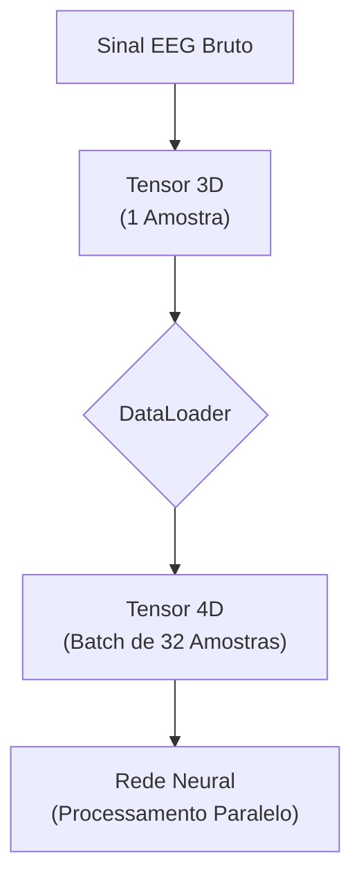
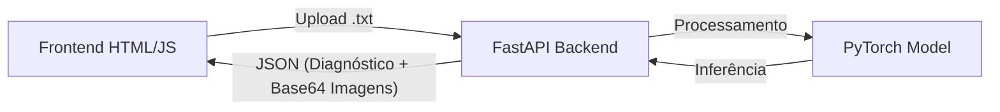
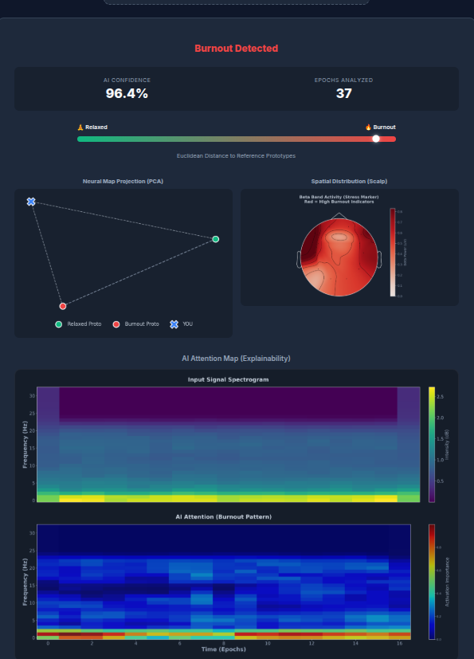
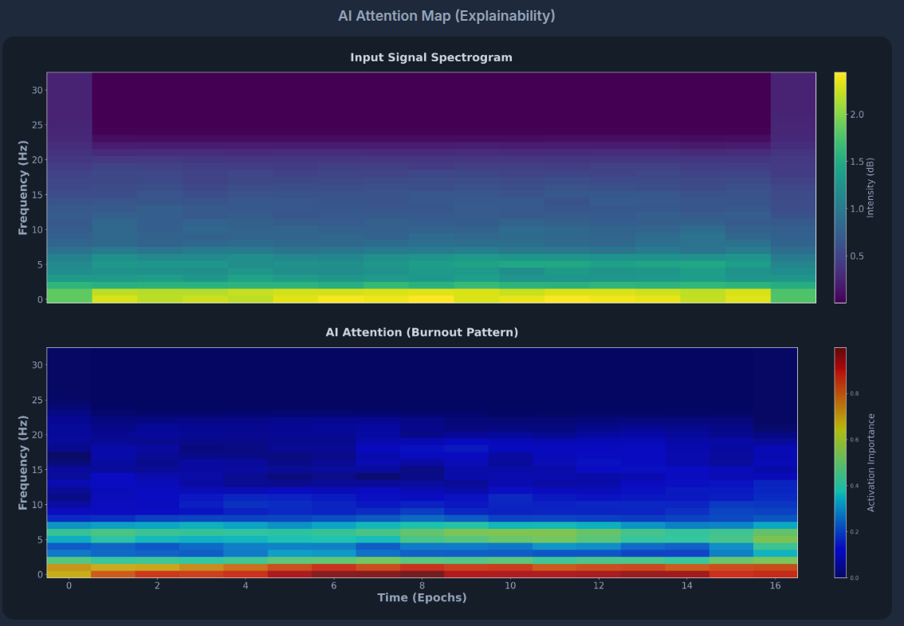
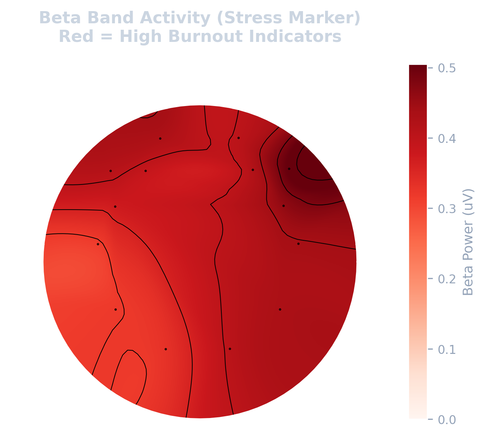

# Detecção de Burnout via EEG: Uma Abordagem Independente de Sujeito com Aprendizado Few-Shot e Explicabilidade (XAI)

Detecção de Burnout em Tempo Real usando Few-Shot Learning com uma Camada de Interpretabilidade (XAI) gerando um mapa de calor do cérebro indicando o porquê da decisão. O projeto utiliza Subject-Independent Classification com Transfer Learning para validação em indivíduos de outros datasets..

## Arquitetura do Sistema

### Fluxo de Processamento de Dados


## Arquitetura da Aplicação Web


# Dataset

[Link do Dataset Usado](https://ieee-dataport.org/open-access/stew-simultaneous-task-eeg-workload-dataset)

## Resumo do Dataset
É um dataset que contém dados de 48 participantes que estavam em uma carga de trabalho excessivo utilizando o SIMKAP (Vienna Test System: SIMKAP (Simultaneous Capacity/Multi-Tasking). A atividade cerebral foi registrada antes (repouso) e durante o teste.
* **Equipamento:** Emotiv (14 canais).
* **Frequência:** 128Hz.
* **Duração:** 2.5 minutos por estágio.
* **Avaliação Subjetiva:** Escala de 1 a 9 (registrada em rating.txt).

## Instrução do Dataset
O dado de cada indivíduo segue a convenção subNum_task.txt.
* sub01_lo.txt: EEG do indivíduo 1 em descanso (Low Workload).
* sub23_hi.txt: EEG do indivíduo 23 em atividade (High Workload/Burnout).
* **Canais:** AF3, F7, F3, FC5, T7, P7, O1, O2, P8, T8, FC6, F4, F8, AF4.

### Conceitos Fundamentais para Entendimento do Projeto
Para processar os sinais cerebrais (EEG) de forma eficiente, este projeto utiliza estruturas de dados específicas do **Pytorch**. Abaixo está explicado como os dados são organizados na memória.

1. **Tensor**
Na matemática e na computação, um **Tensor** é uma generalização de matrizes para múltiplas dimensões de um único tipo. ALgumas características do **Tensor**:
* É a estrutura de dados padrão para Deep Learning porque permite operações matemáticas em paralelo na GPU.
* Possui suporte integrado para GPUs habilitadas da NVIDIA-CUDA, habilitando, significantemente, speedups para grandes computações
* Integração de automação de cálculo de gradientes via ```autograd``` do Pytorch, essencial para treinamento de redes neurais.
* Gerenciamento de memória automática com garbage collection.
* Muito similar com o NumPy, facilitando a conversão de dados.
No contexto deste projeto, cada amostra de EEG de 4 segundos não é apenas uma lista de números, são matrizes de 3 dimensões:
* **Shape (Formato) de uma amostra:** [14, 33, 17]:
   * **14 Canais:** Os sensores físicos (eletrodos) na cabeça.
   * **33 Frequências:** A decomposição do sinal (Alpha, Beta, Gamma, etc).
   * **17 Janelas de Tempo:** Como o sinal muda ao longo daqueles 4 segundos.

2. **Batch (Lote):**
O **Batch** é um agrupamento de várias amostras (tensores) para serem processadas simultaneamente pela Rede Neural. Em vez de a rede aprender com um paciente por vez, ela olha para um grupo, no caso, de 32 pacientes de uma vez só.
* **Shape do Batch:** [32, 14, 33, 17].
   * A primeira dimensão (32) representa a quantidade de amostras naquele agrupamento.
Por que usar Batches:
* **Estabilidade Estatística:** No aprendizado Few-Shot (_Prototypical Networks_), precisa-se de várias amostras para calcular uma média(protótipo) confiável da classe. Um único exemplo ruidoso poderia enganar a rede, mas a média de 32 exemplos cancela os ruídos.
* **Eficiência de Hardware:** As GPUs são projetadas para multiplicar matrizes gigantes. Processar 32 exames juntos leva, praticamente, o mesmo tempo que processar 1, acelerando drasticamente o treinamento.
* **Nível Arquitetural:** O código utiliza a função ```utils.get_prototypes```, que opera sobre o batch inteiro para transformar ele em conhecimento. O processo ocorre em três etapas:
   1. **Filtragem (Masking):** O algoritmo separa os embeddings (vetores de características) em dois grupos: os que pertencem à classe "Relaxado" e os que pertencem à classe "Burnout".
   2. **Cálculo da Média (Mean):** Para cada grupo, ele calcula a média artimética de todos os vetores. Esse vetor médio é chamado de protótipo.
   3. **Empilhamento (Stacking):** A função retorna um novo tensor contendo apenas esses dois vetores ideais. É contra esses protótipos que a rede medirá as distâncias para aprender a classificar novos exemplos.

# Estrutura do Projeto
```text
eeg-Burnout-fewshot/
│
├── data/                        # ONDE FICAM OS DADOS
│   ├── raw/                     # Dados originais intocados.
│   ├── processed/               # Dados limpos e convertidos em tensores.
│
├── notebooks/                   # JUPYTER NOTEBOOKS (Para testes rápidos e exploração)
│   ├── 01_data_exploration.ipynb
│   ├── 02_preprocessing_test.ipynb
│   └── 03_shap_visualization_demo.ipynb
│
├── src/                         # CÓDIGO FONTE OFICIAL
│   ├── __init__.py              # Inicializador do pacote
│   ├── config.py                # Variáveis globais (Canais, Frequências, Caminhos)
│   ├── data_loader.py           # Scripts para carregar e transformar dados (Dataset Class do PyTorch)
│   ├── inference.py             # Script para classificação de novos pacientes
│   ├── make_mock_data.py        # Gerador de dados sintéticos para testes de fluxo
│   ├── models.py                # Definição das classes das Redes Neurais (CNN, EEGEmbedding)
│   ├── preprocessing.py         # Pipeline: Filtro de Banda -> Janelamento -> STFT
│   ├── test_metrics.py          # Geração de Matriz de Confusão e Relatório de Acurácia
│   ├── train_fewshot.py         # Script para o Fine-Tuning (Few-Shot Learning)
│   └── utils.py                 # Funções auxiliares (salvar modelos, plotar gráficos de loss)
│   ├── visualize_xai_utils.py   # Script executável para gerar e salvar imagens do XAI
|   |── visualize_spatial.py     # Script para gerar o mapa topográfico
│   ├── xai_utils.py             # Biblioteca de funções para Grad-CAM e visualização
│
├── results/                     # SAÍDAS DO MODELO
│   ├── saved_models/            # Pesos treinados (.pth)
│   ├── figures/                 # Gráficos gerados (Matrizes, Heatmaps)
│── ablation_study/              # Estudo de Treinamento da Rede Com e Sem o Filtro
│   ├── run_batch.py             # Roda o train_fewshot.py 5 vezes e captura o Loss
│   ├── plot_ablation.py         # Plota o Gráfico de Linha do Loss Com e Sem o Filtro
│
├── web/                         # APLICAÇÃO WEB
│   ├── backend/
│   │   └── app.py               # API FastAPI
│   ├── frontend/
│       ├── index.html           # Interface do Usuário
│       ├── script.js            # Lógica do Dashboard
│       └── style.css            # Estilização
│
├── README.md                    # Documentação do projeto
└── requirements.txt             # Dependências do Python.
```
> Para baixar as dependências do projeto: **pip install -r requirements.txt**

# Instalação e Configuração

Recomenda-se o uso de um ambiente virtual (venv) para isolar as dependências.

1. Clone o Repositório:
```bash
git clone https://github.com/gabfarmarcondes/eeg-Burnout-fewshot.git
cd eeg-Burnout-fewshot
```

2. Crie e ative o ambiente virtual:
```bash
python3 -m venv venv
source venv/bin/activate  # Linux/Mac

venv\Scripts\activate     # Windows
```

3. Instale as dependências:
```bash
pip install -r requirements.txt
```

4. Preparação dos Dados: 
Se não tiver o dataset real (STEW), gere dados sintéticos para teste:
```bash
python3 src/make_mock_data.py
```
_Se tiver o dataset real, coloque os arquivos ```.txt``` em ```data/raw/```._

5. Pré-processamento:
Limpa o sinal, aplica filtros de frequência e converte para Espectrogramas (Time-Frequency):
```bash
python3 src/preprocessing.py
```

6. Treinamento do Modelo:
Treina a Rede Neural para aprender a métrica de distância entre Relaxado e Burnout:
```bash
python3 src/train_fewshot.py
```

7. Validação e Métricas:
Gera a Matriz de Confusão e calcula a Acurácia em dados de teste (sujeitos não vistos):
```bash
python3 src/test_metrics.py
```

8. Explicabilidade (XAI):
Gera uma imagem visual mostrando onde a IA observou no cérebro para detectar o Burnout:
```bash
python3 src/visualize_xai_utilis.py
```
_A imagem será salva na pasta ```results/```._

9. Inferência (Simulação Real):
Simula a chegada de um paciente desconhecido e realiza o diagnóstico:
```bash
python3 src/inference.py
```

10. Visualização Espacial:
Mostra o mapa da cabeça onde ocorreu o Burnout, que é identificado pela vermelhidão da área.
```bash
python3 src/visualize_spatial.py
```

11. Rodando o Estudo do Filtro:
Foi estudado como a rede se comportaria com e sem o filtro passa-banda (1-40Hz). Para a execução do estudo:
1. Execute:
```bash
python3 src/preprocessing.py
```
2. Execute:
```bash
cd results/ablation_study
```

```bash
python3 ablation_study/run_batch.py
```
Irá capturar o Loss, com o filtro, 5 vezes no terminal, incluindo a média e o desvio padrão.

12. Gráfico do Estudo:
Foi plotado um gráfico do estudo para mostrar visualmente os dados obtidos.
```bash
python3 ablation_study/plot_ablation.py
```

13. Rodar a Aplicação Web:
Para que seja possível rodar a aplicação web é preciso iniciar o servidor Backend:
```bash
uvicorn web.backend.app:app --reload
```
Em seguida, abra o arquivo `web/frontend/index.html` no seu navegador.

# Resultado Esperado

### **1. Dashboard de Diagnóstico**
A interface web permite o upload de arquivos EEG e exibe o diagnóstico em tempo real, integrando três visões críticas: Geométrica (PCA), Temporal (XAI) e Espacial (Topomap)



### **2. Explicabilidde (XAI)**
Utilizando Grad-CAM, o modelo destaca no espectograma quais frequências e momentos temporais foram decisivos para o diagnóstico.


**Interpretação:** As manchas vermelhas concentradas na faixa central (13-30Hz) indicam que a IA identificou padrões de ondas Beta (estresse/ansiedade) como determinantes para o diagnóstico de Burnout.

### **3. Análise Espacial (Topomap)**
Mapa topográfico da cabeça focado na onda Beta. Áreas em vermelho indicam hiperatividade cortical associada a sobrecarga cognitiva.



# Estudos e Validação Técnica

## 1- Interpretação da Imagem da Matriz de Confusão: 
A estrutura  é um quadrado dividido em 4 quadrantes:
   ### 1.1. Eixo Vertical/Esquerdo:
   O True Label. Representa o estado real do paciente.
   * 0 = Relaxado.
   * 1 = Burnout.
   ### 1.2. Eixo Horizontal/Baixo:
   Predicted Label. Representa o que a IA previu.
   * 0 = IA disse que é Relaxado.
   * 1 = IA disse que é Burnout.
Portanto:
* O quadrante superior esquerdo (0,0):
   * O paciente estava relaxado.
   * A IA disse que estava relaxado.
   * Conclusão: A IA acertou o estado saudável.
* O quadrante inferior direito (1,1):
   * O paciente estava com Burnout.
   * A IA disse que o paciente estava com Burnout.
   * Conclusão: A IA acertou o estado de Burnout.
* O quadrante superior direito (0,1):
   * O paciente estava relaxado.
   * A IA disse que o paciente estava com Burnout.
   * Conclusão: A IA errou em dizer que o paciente estava com Burnout.
* O quadrante inferior esquerdo (1,0):
   * O paciente estava com Burnout.
   * A IA disse que o paciente estava relaxado.
   * Conclusão: A IA errou em dizer que o paciente estava relaxado.

## 2. Explicação do Gráfico do Ablation Study:
O gráfico representa o estudo comparativo de impacto do filtro passa-banda (1-40Hz) na convergência da Rede Neural. O experimento consistiu em 5 sessões de treinamento independentes para avaliar a estabilidade do modelo:
* **Linha Verde (Com Filtro):** Representa o modelo final validado. A oscilação observada reflete a complexidade de aprender padrões neurofisiológicos reais (ondas Beta) sem a influência de ruídos.
* **Linha Vermelha (Sem Filtro):** Representa o controle (dados brutos). A menor oscilação sugere que a rede encontrou "atalhos" (overfitting) baseados em artefatos musculares constantes, o que invalida seu uso clínico.

> **Como Criar o Gráfico:** Está explícito a forma de criar o gráfico no tópico **Instalação e Configuração** nos passos 11 e 12.
> **Detalhes Técnicos:** Para a discussão completa sobre a decisão de manter o filtro e a análise estatística dos dados, consulte o relatório técnico em [`results/ablation_study/RESULTS.md`](results/ablation_study/RESULTS.md).

# Autor

**Gabriel Farias Marcondes**

* Curso: Ciência da Computação

* Projeto: Neurocomputação e BCI
