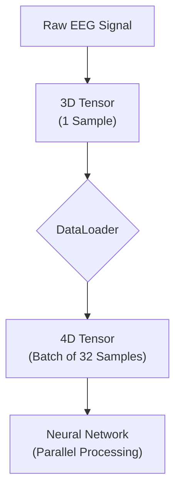
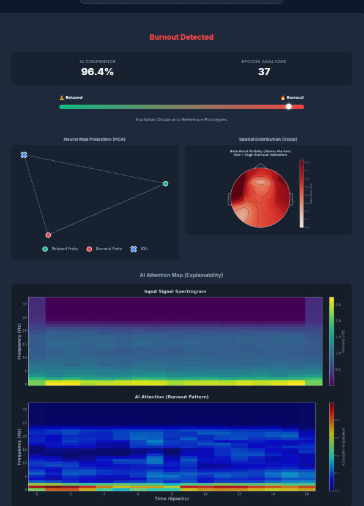
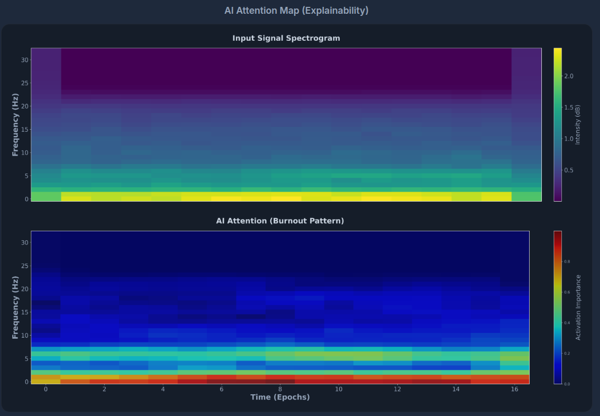
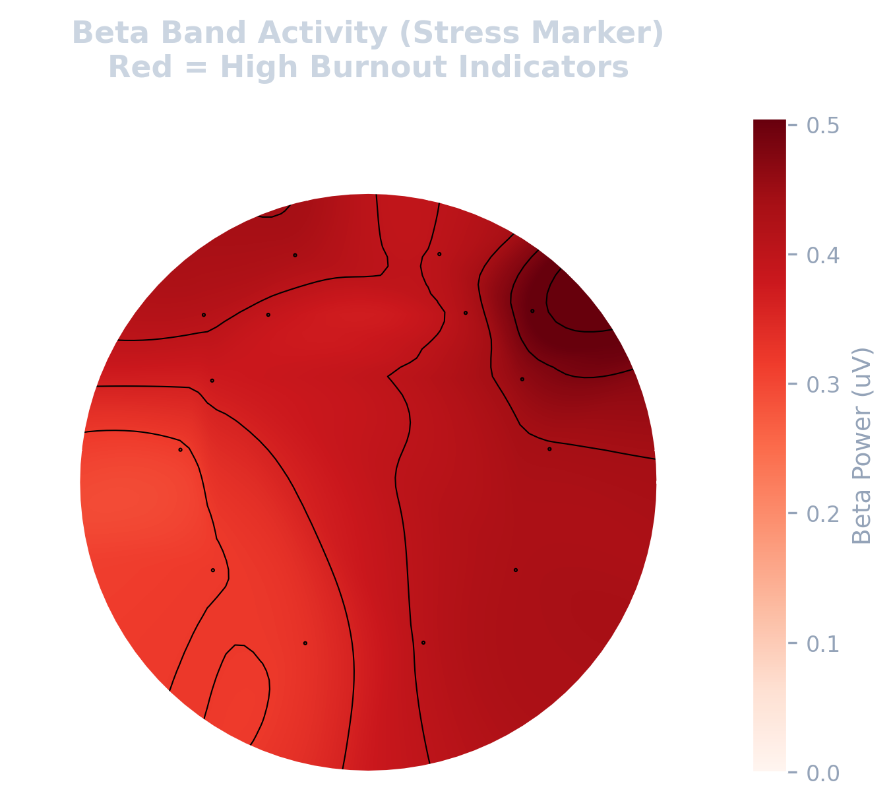

# Burnout Detection via EEG: A Subject-Independent Approach with Few-Shot Learning and Explainability (XAI)

Real-Time Burnout Detection using Few-Shot Learning with an Interpretability Layer (XAI) generating a brain heatmap indicating the reasoning behind the decision. The project utilizes Subject-Independent Classification with Transfer Learning for validation on individuals from other datasets.

## System Architecture

### Data Processing Flow

```mermaid
graph TD
    A["Raw EEG Signal"] --> B["3D Tensor<br>(1 Sample)"]
    B --> C{"DataLoader"}
    C --> D["4D Tensor<br>(Batch of 32 Samples)"]
    D --> E["Neural Network<br>(Parallel Processing)"]
```

## Web Application Architecture

```mermaid
graph LR
    A[Frontend HTML/JS] -- Upload .txt --> B[FastAPI Backend]
    B -- Processing --> C[PyTorch Model]
    C -- Inference --> B
    B -- JSON (diagnosis + Base64 Images) --> A
```

# Dataset

[Link to the Dataset Used](https://ieee-dataport.org/open-access/stew-simultaneous-task-eeg-workload-dataset)

## Dataset Summary
It is a dataset containing data from 48 participants who were under excessive workload using SIMKAP (Vienna Test System: SIMKAP - Simultaneous Capacity/Multi-Tasking). Brain activity was recorded before (rest) and during the test.

* **Equipment:** Emotiv (14 channels).
* **Frequency:** 128Hz.
* **Duration:** 2.5 minutes per stage.
* **Subjective Rating:** Scale from 1 to 9 (recorded in rating.txt).

## Dataset Instruction
Each individual's data follows the convention subNum_task.txt.
* sub01_lo.txt: EEG of individual 1 at rest (Low Workload).
* sub23_hi.txt: EEG of individual 23 during activity (High Workload/Burnout).
* **Channels:** AF3, F7, F3, FC5, T7, P7, O1, O2, P8, T8, FC6, F4, F8, AF4.

### Fundamental Concepts for Project Understanding
To process brain signals (EEG) efficiently, this project uses specific **PyTorch** data structures. Below is an explanation of how data is organized in memory.

1. **Tensor**
In mathematics and computing, a **Tensor** is a generalization of matrices to multiple dimensions operation on the GPU.
* It is the standard data structure for Deep Learning because it enables parallel mathematical operations in the GPU.
* It has built-in support for **NVIDIA-CUDA** enabled GPUs, significantly enabling speedups for large computing.
* Integration of gradient calculation automation via PyTorch's `autograd`, essential for neural network training.
* Automatic memory management with garbage collection;
* Very similar to NumPy, facilitating data conversion. In the context of this project, each 4-second EEG sample is not just a list of numbers, they are 3-dimensional matrices:
* **Shape of a sample:** [14, 33, 17]:
   * **14 Channels:** The physical sensors (electrodes) on the head.
   * **33 Frequencies:** The signal decomposition (Alpha, Beta, Gamma, etc).
   * **17 Time Windows:** How the signal changes over those 4 seconds.

2. **Batch:**
The **Batch** is a grouping of multiple samples (tensors) to be processed simultaneously by the Neural Network. Instead of the network learning from one patient at a time, it looks at a group, in this case, 32 patients at once.
* **Batch Shape:** [32, 14, 33, 17].
   * The first dimension (32) represents the amount of samples in that group.
Why we use Batches?:
* **Statistical Stability:** In Few-Shot learning (Prototypical Networks), several samples are needed to calculate a reliable mean (prototype) of the class. A single noisy example could mislead the network, but the average of 32 examples cancels out the noise.
* **Hardware Efficiency:** GPUs are designed to multiply giant matrices. Processing 32 exams together takes practically the same time as processing 1, drastically accelerating training.
* **Architectural Level:** The code uses the `utils.get_prototypes` function, which operates on the entire batch to transform it into knowledge. The process occurs in three steps:
   1. **Masking:** The algorithm separates the embeddings (feature vectors) into two groups: those belonging to the "Relaxed" class and those belonging to the "Burnout" class.
   2. **Mean Calculation:** For each group, it calculates the arithmetic mean of all vectors. This mean vector is called a prototype.
   3. **Stacking:** The function returns a new tensor containing only these two ideal vectors. It is against these prototypes that the network will measure distances to learn to classify new examples.

# Project Structure
```text
eeg-Burnout-fewshot/
│
├── data/                        # WHERE DATA IS STORED
│   ├── raw/                     # Original untouched data.
│   ├── processed/               # Cleaned data converted into tensors.
│
├── notebooks/                   # JUPYTER NOTEBOOKS (For quick tests and exploration)
│   ├── 01_data_exploration.ipynb
│   ├── 02_preprocessing_test.ipynb
│   └── 03_shap_visualization_demo.ipynb
│
├── src/                         # OFFICIAL SOURCE CODE
│   ├── __init__.py              # Package initializer
│   ├── config.py                # Global variables (Channels, Frequencies, Paths)
│   ├── data_loader.py           # Scripts to load and transform data (PyTorch Dataset Class)
│   ├── inference.py             # Script for classifying new patients
│   ├── make_mock_data.py        # Synthetic data generator for flow testing
│   ├── models.py                # Definition of Neural Network classes (CNN, EEGEmbedding)
│   ├── preprocessing.py         # Pipeline: Band Filter -> Windowing -> STFT
│   ├── test_metrics.py          # Confusion Matrix Generation and Accuracy Report
│   ├── train_fewshot.py         # Script for Fine-Tuning (Few-Shot Learning)
│   └── utils.py                 # Helper functions (save models, plot loss graphs)
│   ├── visualize_xai.py         # Executable script to generate and save XAI images
|   |── visualize_spatial.py     # Script to generate the topographic map
│   ├── xai_utils.py             # Library of functions for Grad-CAM and visualization
│
├── results/                     # MODEL OUTPUTS
│   ├── saved_models/            # Trained weights (.pth)
│   ├── figures/                 # Generated graphs (Matrices, Heatmaps)
│── ablation_study/              # Network Training Study With and Without Filter
│   ├── run_batch.py             # Runs train_fewshot.py 5 times and captures Loss
│   ├── plot_ablation.py         # Plots the Loss Line Graph With and Without Filter
│
├── web/                         # WEB APPLICATION
│   ├── backend/
│   │   └── app.py               # FastAPI API
│   ├── frontend/
│       ├── index.html           # User Interface
│       ├── script.js            # Dashboard Logic
│       └── style.css            # Styling
│
├── README.md                    # Project documentation
└── requirements.txt             # Python dependencies.
```
> To download project dependencies: **pip install -r requirements.txt**

# 🐳 Quick Start with Docker (Recommended)
The simplest and most robust way to run the Web Application (Frontend + Backend) without worrying about Python versions or system dependencies.

## Prerequisites
* [Docker Desktop](https://www.docker.com/products/docker-desktop/) installed and running.

### Step by Step

1. **Clone the repository:**
   ```bash
   git clone [https://github.com/gabfarmarcondes/eeg-Burnout-fewshot.git](https://github.com/gabfarmarcondes/eeg-Burnout-fewshot.git)
   cd eeg-Burnout-fewshot
   ```
2. **Start the application:** Execute the following command in the terminal:
   ```bash
   docker compose up --build
   ```
Docker will download the Python image, install dependencies from `requirements.txt`, configure the graphics server, and start FastAPI.

3. **Access:** Open your browser at [Application Link](http://localhost:8000)
> To stop the application, press `Ctrl + C` in the terminal.
> To remove the containers, use `docker compose down`.

# Installation and Configuration (Manual Method)

It is recommended to use a virtual environment (venv) to isolate dependencies.

1. Clone the Repository:
```bash
git clone https://github.com/gabfarmarcondes/eeg-Burnout-fewshot.git
cd eeg-Burnout-fewshot
```

2. Create and activate the virtual environment:
```bash
python3 -m venv venv
source venv/bin/activate  # Linux/Mac

venv\Scripts\activate     # Windows
```

3. Install dependencies:
```bash
pip install -r requirements.txt
```

4. Data Preparation: If you do not have the real dataset (STEW), generate synthetic data for testing:
```bash
python3 src/make_mock_data.py
```
_If you have the real dataset, place the `.txt` files in `data/raw/`._

5. Preprocessing: Cleans the signal, applies frequency filters, and converts to Spectrograms (Time-Frequency):
```bash
python3 src/preprocessing.py
```

6. Model Training: Trains the Neural Network to learn the distance metric between Relaxed and Burnout:
```bash
python3 src/train_fewshot.py
```

7. Validation and Metrics: Generates the Confusion Matrix and calculates Accuracy on test data (unseen subjects):
```bash
python3 src/test_metrics.py
```

8. Explainability (XAI): Generates a visual image showing where the AI looked in the brain to detect Burnout:
```bash
python3 src/visualize_xai.py
```
_The image will be saved in the `results/` folder._

9. Inference (Real Simulation): Simulates the arrival of an unknown patient and performs the diagnosiss:
```bash
python3 src/inference.py
```

10. Spatial Visualization: Shows the map of the head where Burnout occurred, which is identified by the redness of the area.
```bash
python3 src/visualize_spatial.py
```

11. Running the Filter Study: A study was conducted on how the network behaves with and without the band-pass filter (1-40Hz). To execute the study:
1. Run:
```bash
python3 src/preprocessing.py
```
2. Run:
```bash
cd results/ablation_study
```

```bash
python3 ablation_study/run_batch.py
```
It will capture the Loss, with the filter, 5 times in the terminal, including the mean and standard deviation

12. Study Graph: A graph of the study was plotted to visually show the obtained data.
```bash
python3 ablation_study/plot_ablation.py
```

13. Running the Web Application: To run the web application, you need to start the Backend server:
```bash
uvicorn web.backend.app:app --reload
```
Then, open the `web/frontend/index.html` file in your browser.

# Expected Result

### **1. Diagnostic Dashboard**
The web interface allows the upload of EEG files and displays the diagnosis in real-time, integrating three critical views: Geometric (PCA), Temporal (XAI), and Spatial (Topomap).



### **2. Explainability (XAI)**
Using Grad-CAM, the model highlights in the spectrogram which frequencies and temporal moments were decisive for the diagnosis


**Interpretation:** The red spots concentrated in the central band (13-30Hz) indicate that the AI identified Beta wave patterns (stress/anxiety) as determinants for the Burnout diagnosis.

### **3. Spatial Analysis (Topomap)**
Topographic map of the head focused on the Beta wave. Areas in red indicate cortical hyperactivity associated with cognitive overload.


# Studies and Technical Validation

## 1- Interpretation of the Confusion Matrix Image:
The structure is a square divided into 4 quadrants:
   ### 1.1. Vertical/Left Axis:
   O True Label. Represents the patient's actual state.
   * 0 = Relaxed.
   * 1 = Burnout.
   ### 1.2. Horizontal/Bottom Axis:
   Predicted Label. Represents what the AI predicted.
   * 0 = AI said it is Relaxed.
   * 1 = AI said it is Burnout.
Therefore:
* The upper left quadrant (0,0):
   * The patient was relaxed.
   * The AI said they were relaxed.
   * Conclusion: The AI correctly identified the healthy state.
* The lower right quadrant (1,1):
   * The patient had Burnout.
   * The AI said the patient had Burnout.
   * Conclusion: The AI correctly identified the Burnout state.
* The upper right quadrant (0,1):
   * The patient was relaxed.
   * The AI said the patient had Burnout.
   * Conclusion: The AI incorrectly identified the patient as having Burnout.
* The lower left quadrant (1,0):
   * The patient had Burnout.
   * The AI said the patient was relaxed.
   * Conclusion: The AI incorrectly identified the patient as relaxed.

## 2. Explanation of the Ablation Study Graph:
The graph represents the comparative impact study of the band-pass filter (1-40Hz) on Neural Network convergence. The experiment consisted of 5 independent training sessions to evaluate model stability:
* **Green Line (With Filter):** Represents the final validated model. The observed oscillation reflects the complexity of learning real neurophysiological patterns (Beta waves) without the influence of noise.
* **Red Line (Without Filter):** Represents the control (raw data). The smaller oscillation suggests that the network found "shortcuts" (overfitting) based on constant muscle artifacts, which invalidates its clinical use.

> **How to Create the Graph:** It is explicitly explained how to create the graph in the **Installation and Configuration** topic in steps 11 and 12.
> **Technical Details:** For the full discussion on the decision to keep the filter and the statistical analysis of the data, consult the technical report in [`results/ablation_study/RESULTS.md`](results/ablation_study/RESULTS.md).

# Author

**Gabriel Farias Marcondes**

* Major: Computer Science

* Project: Neurocomputing and BCI
